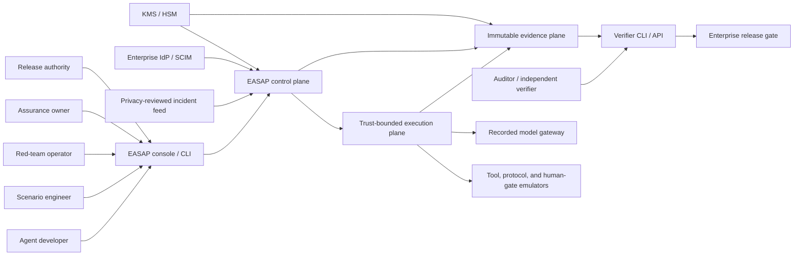
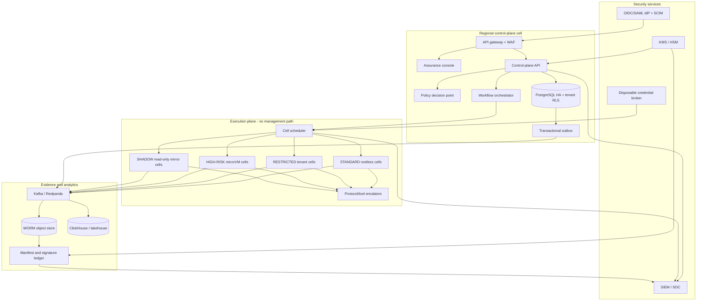
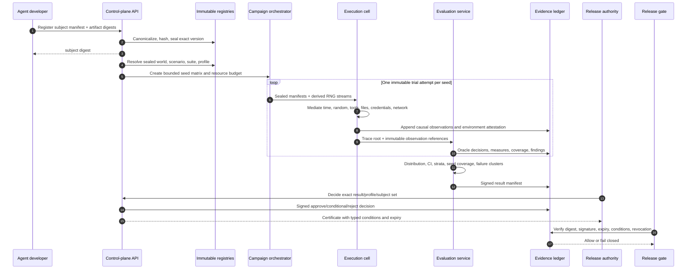
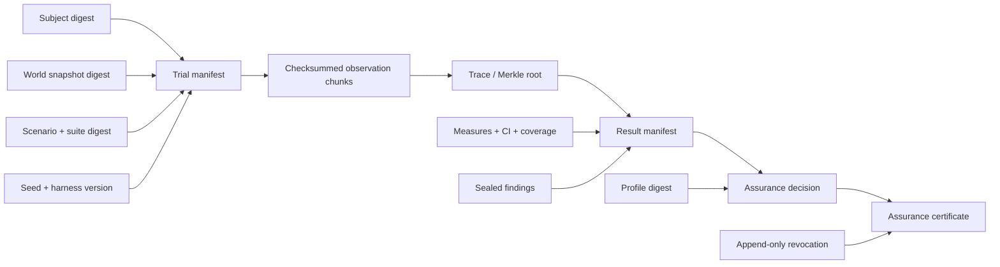

# EASAP enterprise architecture

Status: normative implementation design for EASAP-PS-001 v1.0. The checked-in
application is a runnable **STANDARD reference mode**, not a claim of production
scale or HIGH-RISK isolation.

## Architectural drivers

1. Assurance binds an exact deployed system configuration, never an abstract model.
2. Executed inputs are immutable, versioned, canonicalized, and content-addressed.
3. Subjects see capabilities, not infrastructure. Undeclared effects fail closed.
4. Deterministic components must reproduce the same harness-visible trace.
5. Evaluation code and oracles remain independent from subject code.
6. Evidence is append-only, chained, signed, exportable, and independently verifiable.
7. Authoring/control availability is isolated from execution capacity degradation.
8. Tenant, classification, and isolation boundaries are enforced at every layer.

## System context

## Logical planes and bounded contexts

| Specification plane | Bounded context | Primary responsibility |
|---|---|---|
| Assurance | Profile registry and decision service | Versioned profiles, gates, confidence, residual risk, materiality, decisions, conditions, expiry, revocation |
| World | World registry and snapshot service | Digital-twin definitions, temporal snapshots, forks, deterministic merge policies, fidelity claims |
| Scenario | Scenario compiler and suite vault | Typed DSL, fixtures, events, actors, invariants, injectors, oracles, hidden-suite sealing |
| Execution | Campaign orchestrator and execution cells | Seed matrices, leases, virtual clock, deterministic RNG, effect mediation, record/replay, teardown |
| Evaluation | Oracle and analysis service | Independent checks, measures, statistics, coverage, clustering, minimization, judge disagreement |
| Evidence | Evidence ledger and verifier | Manifests, observations, trace roots, signatures, exports, approvals, revocations, verification |

Additional supporting contexts:

- Identity and policy: tenant membership, roles, classification, purpose, separation
  of duties, dual control.
- Artifact registry: subject bundles, prompts, tools, policies, SBOMs, memory images,
  connectors, runtime dependencies, and build provenance.
- Incident regression: quarantined ingestion, redaction, privacy review, scenario
  derivation, and publication approval.
- Capacity and operations: quotas, admission, saturation, telemetry, retention, and DR.

The control plane begins as a modular deployment. Execution is separate from day one
because it has a distinct trust boundary and scaling model. Other contexts split into
services only when isolation, ownership, or load justifies the operational cost.

## Production deployment

### Network boundaries

- Control-plane ingress terminates at an API gateway with tenant-aware rate limits,
  request IDs, body limits, and threat filtering.
- Execution cells have no route to the management plane. They receive sealed bundles
  through a one-way staging channel and emit observations through an authenticated
  append channel.
- Subject traffic can reach only harness adapters. Adapters route declared calls to
  emulators, recorded responses, or specifically approved disposable dependencies.
- HIGH-RISK cells run on dedicated capacity with a microVM boundary, hardware-backed
  workload identity, full recording, and two-person activation.
- SHADOW cells receive a read-only production event mirror. Every write identity and
  destination is replaced with a simulator or sink.

## End-to-end assurance flow

## Deterministic execution model

### Scenario compilation

Human-authored JSON/YAML compiles to canonical versioned IR. The compiler:

- resolves immutable subject, world, sub-scenario, injector, and oracle digests;
- types actors, resources, events, actions, expected observations, invariants, and
  stop rules;
- calculates the least capability set and rejects implicit inheritance;
- rejects floating aliases such as `latest` from executable manifests;
- seals hidden fixtures, seeds, and oracle internals behind opaque suite handles;
- rejects arbitrary code; production extensions use signed deterministic WASM with
  a fixed import surface.

### Scheduler and randomness

- Events are ordered by `(logical_time, phase, actor_id, stable_event_id)`.
- RNG streams derive from `(campaign_seed, component_path, algorithm_version)` so
  one component cannot perturb another component's randomness.
- Parallelism is across trials, not within a deterministic trial.
- Counterfactual trials reuse paired seeds and alter exactly one declared variable.
- Remote model/tool calls are intercepted and recorded. Replay uses the recorded
  envelope. A live mutable provider response narrows the reproducibility claim.

### Capability mediation

Every time, random, network, credential, tool, filesystem, model, and human-gate
operation crosses a harness port. A capability token binds tenant, trial, adapter,
operation, resource, budget, and expiry. Missing or mismatched capability means deny,
record, and apply the scenario's fail-closed rule.

### Fault and adversary library

Injectors are deterministic transformations scheduled in the same causal stream:
latency, timeout, partial response, stale data, inconsistent replicas, permission
loss, budget exhaustion, dependency compromise, and human non-response. Adversarial
artifacts cover prompt/tool injection, identity spoofing, capability poisoning,
collusion, sybil behavior, exfiltration, and reward manipulation. Findings remain in
a quarantined store and never become production prompts or tools through copy/paste.

## Evidence model

Canonical JSON uses stable object-key order, preserves array order, rejects
non-finite numbers and undefined values, and hashes UTF-8 bytes with SHA-256.
Production envelopes use asymmetric KMS/HSM signatures and include algorithm, key
ID, issuer, signing time, digest, and payload. The local reference uses Web Crypto
HMAC strictly as a test issuer.

Observation chunks live outside relational storage. SQL stores sequence ranges,
event types, state digests, trace roots, storage URIs, checksums, and retention
policy. Host timestamps and node IDs are operational metadata and are excluded from
the deterministic trace root.

## Data ownership and consistency

| Record | Mutability | Consistency / durability rule |
|---|---|---|
| Subject/world/scenario/profile version | Immutable | A semantic version cannot be rebound to a different digest |
| Campaign | Mutable projection | State transitions use compare-and-set; source events are append-only |
| Trial attempt | Immutable after seal | Retry creates another attempt; never overwrites a result |
| Observation chunk | Immutable | Acknowledged only after checksum-verified durable write |
| Finding | Append/supersede only | Never deleted after sealing; protected payload may be crypto-shredded with tombstone retained |
| Decision/certificate | Immutable | Status derives from expiry, material changes, and append-only revocation |
| Audit/evidence event | Append-only | Hash-chained per aggregate and exported to independent storage |

Transactional changes write an outbox record in the same database transaction.
Consumers are idempotent by event ID. Infrastructure retry creates a new trial
attempt; subject failure remains a successful platform execution with a failing
assurance result.

## Scale architecture

The specification's 100,000 concurrent STANDARD trials, 10 million results per
campaign, and one million events/second per regional cluster are production targets,
not results demonstrated by this repository.

- Partition campaigns by tenant and campaign ID; partition trials by stable hash.
- Use admission control and per-tenant weighted fair queues before allocating cells.
- Pre-warm STANDARD cell pools to meet the 5-second p95 target; maintain dedicated
  HIGH-RISK pools for the 30-second p95 target.
- Batch observations into compressed chunks and stream to the regional bus; never
  write individual high-volume events to SQL.
- Aggregate campaign statistics hierarchically and merge sufficient statistics;
  retain seed-level results for verification.
- Surface queue delay, rejected admission, throttling, and capacity loss explicitly.
- Replicate sealed evidence synchronously within the declared RPO-0 failure domain
  before acknowledging the result.

## Local reference mapping

| Production component | Repository implementation |
|---|---|
| Control API | Standard Next.js route adapter |
| Metadata | Portable SQLite/libSQL Drizzle schema |
| Evidence blobs | Compact database manifests; production object-store adapter |
| Orchestration | Synchronous bounded STANDARD reference runner |
| Sandbox | Protocol-level capability mediator, not arbitrary binary containment |
| Evaluation | Portable TypeScript domain module |
| Signing | Web Crypto reference issuer |
| Console | Responsive server/client React console |
| Verifier/gate | Portable domain verifier and CLI examples |

The production ports are intentionally explicit so Kubernetes, PostgreSQL, Kafka,
Temporal, KMS, and microVM adapters can replace local implementations without
changing scenario, result, or assurance contracts.
